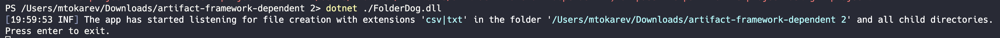
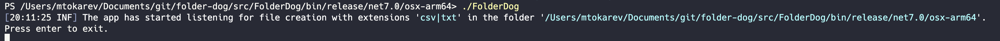

# Overview


Do you need to listen and react for file creation events? Folder Dog is ready to help.
Currently you can send email, webhook or do both.

If you will like this app, please give it a star ⭐️

## How it works
It binds to OS file events and subscribes specifically to file creation events.

## How the app notifies
It uses an SMTP server. You need to open a relay from the IP where this app is running. You can provide the message subject, send from address, and recipient information such as `SendTos`, `SendCcs`, and `SendBccs`.

## How webhook works
This is a nice to have feature for your virtual machine or any other onprem server type where you need to bind and execute something on the file creation event (similar functionality is available out of the box for some cloud resources, such as Azure Storage Account).

Moreover, if you are seeking the tool that can listen webhooks and execute scripts, feel free to check this [out](https://github.com/MTokarev/webhookshell).

Here is configuration example:
```json
"Webhook": {
  "Url": "http://localhost:58427/webhook/v1",
  "Method": "POST",
  "Body": {
    "Key": "<YourSecretKey>",
    "Script": "Test-Script.ps1",
    "Param": "-Param1 \"{{fileName}}\" -Param2 \"{{fileFullPath}}\""
  }
}
```

`URL` - WebHook server address
`Method` - Can be `POST` or `GET`
`Body` - It is essential a dictionary. You can provide your value here. The one thing to remember - `{{fileName}}` and `{{fileFullPath}}` masks will be replaced with the values from the file event. Also, despite you can provide a number or the datetime as a value everything will be converted to a string. 


Another configuration example:
```json
"Webhook": {
  "Url": "http://localhost:58427/webhook/v1",
  "Method": "POST",
  "Body": {
    "MyAwesomeParam": "OmgItIsAWebhook",
    "NotThatAwesome": "ButStill",
    "ThisWillBeConvertedToAString": 1
  }
}
```

And one more with get:
```json
"Webhook": {
  "Url": "http://azure-function.azure.com/myAwesomeFunc",
  "Method": "GET"
}
```
Currently, you cannot pass the values from the file event using `GET` method. It can be easily integrated. If you need it, then welcome to a discussion section on this github page.

## How do I know that the app is working
Once you run the app, it will log messages to both the console and to the file log. By default, it creates a `log` directory in the current folder and every day creates a log file. The log files are rotated for 31 days by default.

## Handle edge cases
You can control how to handle edge cases such as:
- A file is still open by another process (Some apps might write content by batches).
- We had already processed the file before, but now received the same event. You can control what to do in this case.

Also, you can provide one or many file extensions to listen to. For example, only excel or csv files.

## Multi threading in the app
Each file creation event executes in a dedicated thread from the `ThreadPool`. If all thread pools are busy, then the event will be queued and processed later.

## Configuration
Configuration file `appsettings.json` must be present in the same app with folder.
Example:
```
{
  "Binding": {
    "FolderPath": "./",
    "ListenInSubfolders": false,
    "FileExtensions": [
      "csv",
      "txt"
    ]
  },

  "FileService": {
    "RepeatAccessAttempts": 3,
    "WaitUntilNextRetryInMilliseconds": 1000,
    "WaitBeforeExecutionInMilliseconds": 1000,
    "SkipProcessedFiles": true
  },

  "Email": {
    "SendFrom": "no-reply@mail.com",
    "SendTos": [
      "user@mail.com"
    ],
    "SmtpServerHost": "<PutYourSmtpServerIpOrHostName>",
    "SmtpServerPortNumber": 25,
    "MessageSubject": "File has been created"
  },
  "Serilog": {
    "MinimumLevel": "Information",
    "Using":  [ "Serilog.Sinks.Console", "Serilog.Sinks.File" ],
    "WriteTo": [
      {
        "Name": "File",
        "Args": {
          "path": "./logs/log-.txt",
          "rollingInterval": "Day",
          "retainedFileCountLimit": 31
        }
      },
      {
        "Name": "Console"
      }
    ]
  }
}
```
- Bindings - provide folder path where to listen as well as file extensions.
- FileService - configuration for the file service to control how to handle edge cases.
- Email - Mail configuration
- Serilog - Logging configuration

## Prerequisites
- .NET 7 runtime if you don't use the self-contained version
- The SMTP server must relay emails from the IP where the app runs

## How to run
You can download the latest release.
If you have a .NET7 runtime installed, then you can chose `framework-dependent`.
It has the smaller footprint.

You can also download a precompiled version for your Operation system.

---

After you extract the artifact from the console run it:
- Framework dependent
  
- Precompiled
  

## Feedback
Please leave [feedback](https://github.com/MTokarev/folder-dog/discussions) to make this small app better ❤️.
